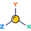
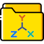

# Object Icons

-  – `mircmd:chemistry:molecule`
-  – `mircmd:chemistry:atomic_coordinates`
-  – `mircmd:chemistry:atomic_coordinates_group`
-  – `mircmd:chemistry:unex`
-  – `mircmd:chemistry:volume_cube`
